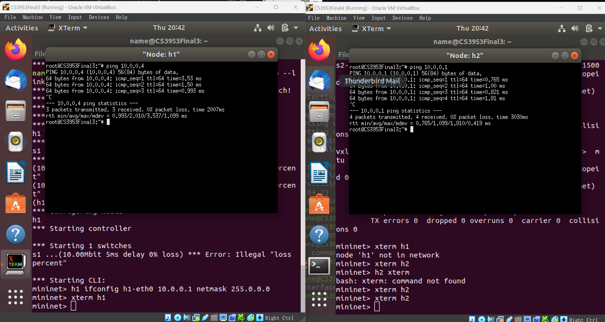
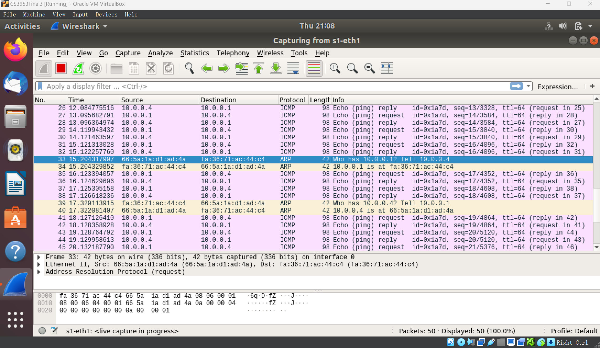

# Computer Network Lab 4: VXLAN Experiment Report

## Initial Configuration

First, since my virtual machine instances were assigned IPs other than 192.168.56.101 and 192.168.56.102, I needed to reconfigure the IP addresses.

I modified the configuration file: `/etc/netplan/01-network-manager-all.yaml`

For VM1, I added:

```yaml
  ethernets:
    enp0s8:
      dhcp4: no
      addresses:
        - 192.168.56.101/24 
```

For VM2, I added:

```yaml
  ethernets:
    enp0s8:
      dhcp4: no
      addresses:
        - 192.168.56.102/24 
```

Then, I ran `sudo netplan apply`.

## mininet Scripts

+ The Mininet script for VM1 is:

```python
from mininet.topo import Topo

class Topo(Topo):
    def build(self):
        s1 = self.addSwitch('s1')
        h1 = self.addHost('h1')
        self.addLink(h1, s1, bw=10, loss=0, delay='5ms')

topos = {'topo': lambda: Topo()}
```

+ The Mininet script for VM2 is:

```python
from mininet.topo import Topo

class Topo(Topo):
    def build(self):
        s2 = self.addSwitch('s2')
        h2 = self.addHost('h2')
        self.addLink(h2, s2, bw=10, loss=0, delay='5ms')

topos = {'topo': lambda: Topo()}
```

## Question 1

The command I added is:

+ For vm1, execute 

`sudo ovs-vsctl add-port s1 vx1 -- set interface vx1 type=vxlan options:remote_ip=192.168.56.102`.

+ For vm2, execute 

`sudo ovs-vsctl add-port s2 vx2 -- set interface vx2 type=vxlan options:remote_ip=192.168.56.101`.

The screenshot of a successful ping is shown below:



## Question 2

The Wireshark captured on s1 is shown below:



The Wireshark captured on enp0s8 is shown below:


From these images, we can observe the ARP protocol at the Data Link Layer, the ICMP protocol at the Network Layer, and the UDP protocol at the Transport Layer (which can be seen in the "User Datagram Protocol" box in the lower-middle part).

The working principle of VXLAN is as follows: After we obtain the original Ethernet frame, we directly add a VXLAN header and a UDP header to it, making it a UDP packet. Then, we add the IP and MAC headers of the physical network so that it can be transmitted to another VM over the physical network. It's like "MAC in UDP".

## Question 3

The bandwidth test between 192.168.56.101 and 192.168.56.102 is shown below:


The bandwidth test between 10.0.0.1 and 10.0.0.4 is shown below:


The bandwidth of the former is 3.94 Gb/s, while the latter is 81.1 Kb/s, which is a 50,000-fold difference!

There are significant differences, and I believe they could be caused by the following reasons:

1. The network needs to perform real-time calculations and additional packet encapsulation and decapsulation. This process is handled by the switch, which lacks strong computational power, thus creating a heavy load.
   
2. After encapsulating many extra headers, the UDP packet is likely to exceed the MTU, causing it to be fragmented again, adding transmission and processing overhead (e.g., recalculating checksums).

## Question 4

After testing, setting the MTU to 1400 significantly improved the bandwidth.

The bandwidth test after optimizing MTU is shown below:


As we can see, the bandwidth between 10.0.0.1 and 10.0.0.4 increased to 7.16 Mb/s, which is a 90.4-fold improvement.
