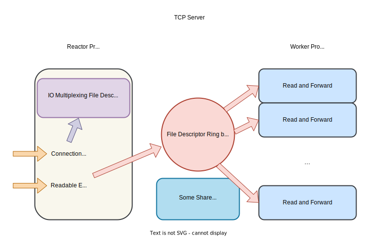

# Computer Network Lab: Chatting Room with Multiple Users

## Environment Setup

Since I am using Python 3 for development, the program needs to be launched with the `python3` command instead of the `python` command mentioned in the task document. We can run `source env_start.sh`, which will set `alias python=python3`. Additionally, `env_start.sh` will perform some necessary configurations related to Mininet.

## Chatting Room Based on TCP Server-Client

### Overview of TCP Server Implementation

The code for this part is implemented in [server.py](server.py), with detailed comments provided.



#### Multi-Processing Reactor Pattern + Non-blocking IO

For the TCP Server, I adopted the classic Reactor pattern, and due to the existence of Python's Global Interpreter Lock, I used multi-processing instead of multi-threading.

Furthermore, the server uses non-blocking IO for read events to prevent malicious attacks from causing the server to wait indefinitely.

We will start one Reactor process (main process) and multiple worker processes.

The main process is responsible for:

+ Listening for connection events. When a connection event arrives, the `accept` system call is used to retrieve the client socket, receive the username sent by the client, and register the epoll event. The username is then stored in a shared map across processes.

+ Listening for read events. When a read event occurs, the corresponding file descriptor is placed into a shared ring buffer, which is processed by the worker processes.

Event listening is implemented using the `epoll` system call for IO Multiplexing.

The worker processes are responsible for:

+ Polling the ring buffer to retrieve file descriptors, reading messages, and forwarding them to the target client. This requires querying the shared map.

For the shared ring buffer across processes, I used `multiprocessing.Queue()`. For the shared map across processes, I implemented it in [utils/PCHashMap.py](utils/PCHashMap.py).

#### Implementing a Simple Application Layer Protocol to Address TCP Packet Concatenation

We encounter a TCP transmission issue: due to the streaming nature of TCP, it is possible for multiple user messages to be sent together and not separated by the server. Therefore, we need to define a customized application layer protocol to record the boundaries of each message. Here, I implemented a simple application layer protocol in [utils/protocol.py](utils/protocol.py), where the message header contains only the length information. This allows us to determine the boundaries of messages when unpacking.

Specifically, the application layer's read/write functions reuse an application layer buffer. Each time, the message is split based on the length in the message header, and any extra content is stored in the buffer for use in the next read, thus avoiding packet concatenation and message loss.

#### Enhancing Robustness

+ Checking Message Format

We need to check if the message format sent by the user is correct. If not, a message indicating a format error is returned to the user. Additionally, if the target client of the message is not connected to the server, the server returns a message indicating that the target user cannot be reached.

+ Handling Client Normal Exit

The server will listen for `EPOLLHUP / EPOLLERROR` events on the client socket and perform corresponding cleanup actions when these events occur. Currently, I have not added measures to handle abnormal client exits (e.g., power failure, where the operating system does not have time to close the socket). Further optimizations could include adding heartbeat packets, or checking the `socket.write` function of the server.

### Overview of TCP Client Implementation

The code for this part is implemented in [user.py](user.py), with detailed comments provided.


#### IO Multiplexing

The implementation of `TCPClient` is straightforward. IO Multiplexing is used to listen for read events on the socket and the terminal. Here, I used the `select` system call for IO Multiplexing, as the number of file descriptors is relatively small.

### Demonstration of Running Results


### Complete Startup Process

Enter the following commands in the virtual machine's command line:

```shell
source env_start.sh
sudo python topology.py
```

Then, in the Mininet command line, enter:

```shell
xterm h1
xterm h2
xterm h3
xterm h4
```

Next, in the shells of `h1, h2, h3`, enter:

```shell
source env_start.sh
python user.py
```

In the shell of `h4`, enter:

```shell
source env_start.sh
python server.py
```

(If the `python` command can be replaced with the `python3` command, the `source env_start.sh` step in the xterm can be omitted.)

## Chatting Room Based on UDP Broadcast


### Overview of UDP Broadcast Implementation


#### IO Multiplexing

The implementation here is similar to `TCPClient`, with minor modifications to switch to broadcast addresses and configure broadcasting using `setsockopt`. The receiving socket needs to be configured with `SO_REUSEADDR` to allow multiple `UDPClient` instances to listen on the same port.

#### Filtering Out Messages Sent by Self

I added a UUID in the message header to identify each client. When receiving messages, if the UUID in the message header matches the client's own UUID, the message is filtered out.

#### About Multicast

Initially, I used multicast locally, with the relevant code as follows:

```python
# Join the multicast group
group = socket.inet_aton(self.broadcast_ip_)
mreq = struct.pack('4sL', group, socket.INADDR_ANY)
recv_socket.setsockopt(socket.IPPROTO_IP, socket.IP_ADD_MEMBERSHIP, mreq)
```

However, during testing on the virtual machine, I found that the virtual machine either did not support multicast or I did not configure it correctly. Therefore, I removed these lines of code related to multicast in the final version and used only broadcast.

### Demonstration of Running Results


### Complete Startup Process

Enter the following commands in the virtual machine's command line:

```shell
source env_start.sh
sudo python topology.py
```

Then, in the Mininet command line, enter:

```shell
xterm h1
xterm h2
xterm h3
xterm h4
```

Next, in the shells of `h1, h2, h3, h4`, enter:

```shell
source env_start.sh
python udpclient.py
```

(If the `python` command can be replaced with the `python3` command, the `source env_start.sh` step in the xterm can be omitted.)