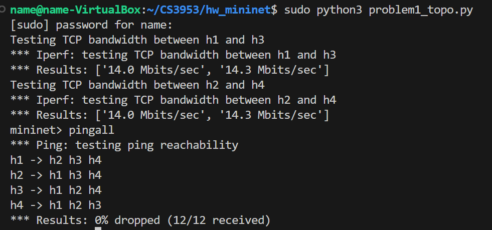
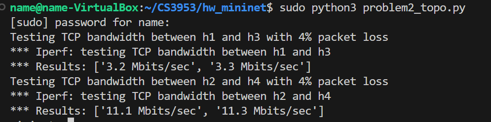
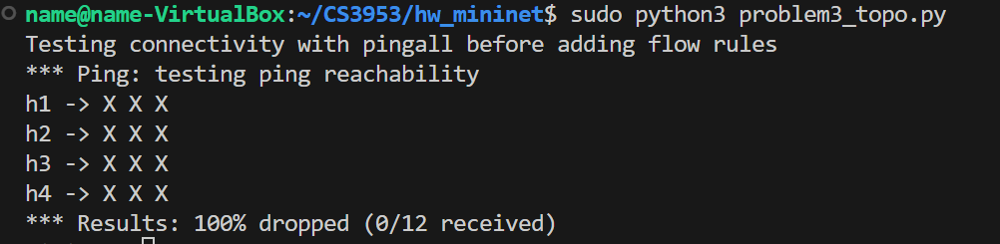
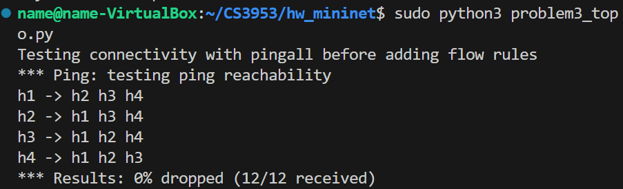

# Computer Network: Lab2

## Problem 1

### Solution



## Problem 2

### Solution



## Problem 3

### Solution

The initial result was:




### Error Analysis

In the constructed network topology, an additional link between `s1` and `s3` creates a loop among the switches `s1`, `s2`, and `s3`. In a network topology with a loop, packets can circulate endlessly, leading to the issues.

In Mininet, the default configuration does not automatically manage loops within the network. As a result, with a loop present among `s1`, `s2`, and `s3`, some hosts may not be able to communicate with each other, causing failures in the `pingall` connectivity test.

### Solution

I used the following script to drop traffic between `s1` and `s3`, and `s3` and `s1`, successfully resolving the problem.

```bash
#!/bin/bash

# Drop traffic on the redundant link between s1 and s3 to avoid loops

# Drop packets entering s1 from port 3 (connected to s3) with high priority
sudo ovs-ofctl add-flow s1 "priority=10,in_port=3,actions=drop"

# Drop packets entering s3 from port 4 (connected to s1) with high priority
sudo ovs-ofctl add-flow s3 "priority=10,in_port=4,actions=drop"

# Add flood rules for unmatched traffic with lower priority to maintain connectivity
sudo ovs-ofctl add-flow s1 "priority=1,actions=flood"
sudo ovs-ofctl add-flow s2 "priority=1,actions=flood"
sudo ovs-ofctl add-flow s3 "priority=1,actions=flood"
```

### The final result

